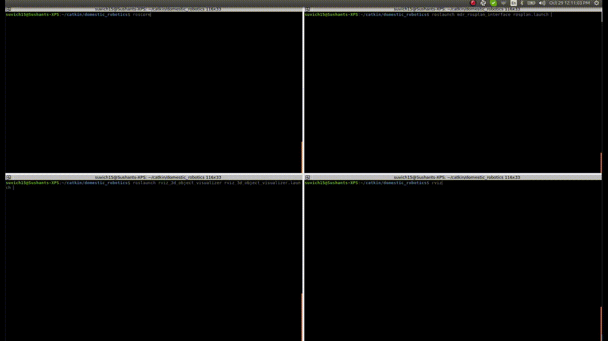

# rviz_3d_object_visualizer

A package containing functionalities for visualizing 3D object models on RViz. 

It consists of i) an RViz panel plugin that loads 3D object meshes and lists them on the panel, and ii) a node that handles reading a MongoDB database to obtain and update the necessary object information. The panel enables selectively visualizing individual objects (e.g. bottle_1, person_2, etc.) or groups of objects (for e.g. bottles, chairs, etc.).

The `rviz_3d_object_visualizer` has been tested on ROS Kinetic and Ubuntu 16.04.


[](docs/videos/RvizDemo.mp4)


## Installation

The package can be installed by cloning this repository and building:
```
git clone https://github.com/b-it-bots/rviz_3d_object_visualizer.git
```
```
catkin build rviz_3d_object_visualizer
```


## Usage

The `rviz_3d_object_visualizer` can be started by running the launch file:
```
roslaunch rviz_3d_object_visualizer rviz_3d_object_visualizer.launch
```

On RViz, the panel can be added from the "Panels" tab: ```Panels -> Add New Panel -> ObjectVisualizationManager```.


### Adding New 3D Models
To add new 3D model categories and corresponding meshes, the below procedure needs to be followed. Lets assume we want to add an object of type `TOY`.
1. Download/convert/create a 3D mesh model as a collada mesh (.dae format) and move it to the directory `resources/meshes/toy/some_toy_name.dae`
2. Extend the mesh-types enum to include the new object type (i.e. `TOY`) in the file `include/dataloader/modelloader/mesh.h`. Ex:<br> 
   ```
    // Others
    BOOK,
    SPRAY_BOTTLE,
    TOY, // This is the newly added line
    UNKNOWN
   ```
3. Similarly, define the string name for the enum in the file `src/dataloader/modelloader/mesh.cpp`. Ex:<br>
    ```
    mesh_map[Types::BOOK] = "BOOK";
    mesh_map[Types::SPRAY_BOTTLE] = "SPRAY_BOTTLE";
    mesh_map[Types::TOY] = "TOY"; // This is the newly added line
    mesh_map[Types::UNKNOWN] = "UNKNOWN";
   ```
4. Add an entry in the config file `config/object_mesh_categories.yaml` as shown below. Here, the key represents the string defined in the database for the object category and the value defines the corresponding enum name previously defined for this object category.<br>
    ```
    book: BOOK
    spray_bottle: SPRAY_BOTTLE
    toy: TOY // This is the newly added line
   ```
5. Finally define the mesh parameters in the config file `config/model_params.yaml` as shown below.
   ```
   TOY:
    Position: [0.0, 0.0, 0.015]
    Orientation: [0.0, 0.0, 0.0]
    Scale: [0.25, 0.25, 0.25]
    Color: [0, 0, 255]
    ResourceFile: "package://rviz_3d_object_visualizer/resources/meshes/toy/some_toy_name.dae"
    UseColorFromMesh: False
    TextOffset: [0, 0.0, 0.1]
   ```
   Here, each parameter has the following meaning:
   * `Position`: The offset correction in the position of the mesh origin such that the object is correctly positioned on the ground plane.
   * `Orientation`: The offset correction in the orientation of the mesh origin such that the object is correctly oriented on the ground plane.
   * `Scale`: The scaling to be applied to the mesh such that it is of the correct metric dimensions. 
   * `Color`: A default color value for the mesh rendering of objects of this category
   * `ResourceFile`: The path to the mesh file
   * `UseColorFromMesh`: If the mesh is textured, this flag must be set to `True` so that the default mesh color is overridden by the texture.
   * `TextOffset`: The offset of the text label (i.e. the name of the object) to be displayed above the 3D mesh.

## Documentation

### Architecture


### RViz Mesh Scene Graph


RViz uses [OGRE](https://www.ogre3d.org/) for rendering 3D elements such as lines, polygons and meshes as a scene graph. The above figure demonstrates an example of the scene graph used by our `ObjectVisualizationManager` RViz plugin for displaying the 3D meshes. In the figure, the leaf nodes (green colored) consist of the 3D meshes that need to be displayed. All other nodes are used to group similar meshes together. When the plugin is loaded, the basic scene graph (orange colored nodes) is automatically set up. When a request to display a mesh for the PERSON or PLANE category is received, that mesh is directly added as a child of the `PERSONS`/`PLANES` group node respectively. In the case of a request to draw an OBJECT, the objects `category` is first inferred, and if a group node for that category does not exist, a new group node (blue colored node) is added as a child of the `OBJECTS` group node. This new object category node is then used as a parent for the requested 3D mesh object.


## Maintainers

`rviz_3d_object_visualizer` is developed and maintained by [Ahmed Faisal Abdelrahman](https://github.com/AhmedFaisal95) and [Sushant Vijay Chavan](https://github.com/Sushant-Chavan).
